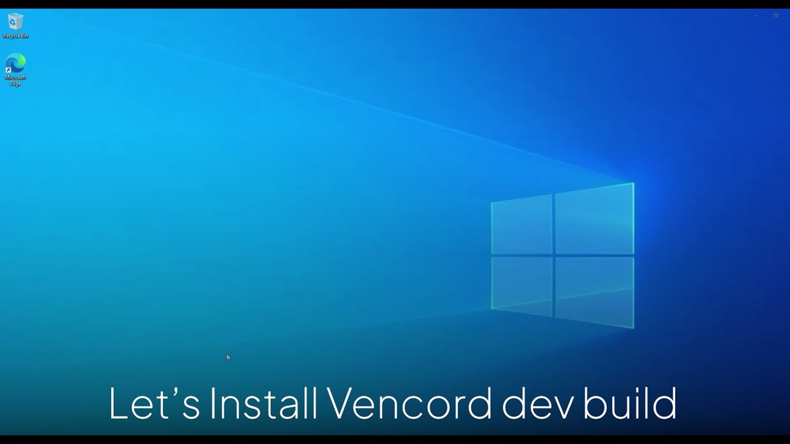

<div align="center">
  

  <h1><strong>fakeProfile</strong></h1>
  An <a href="https://vencord.dev/"><strong>all-in-one Vencord</strong></a> plugin to customize your Discord profile
</div>

<!-- MARKDOWN BADGED -->

<p align="center">
  </a>
  </a>
  <a href="https://discord.gg/ffmkewQ4R7"></a>
</p>
<p align="center">
<a href="https://vencord.dev"></a>

</p>

___

<!-- BODY -->

## 🖥️Selection

 - [fakeProfile](#fakeprofile)
   - [❓What is fakeProfile?](#what-is-fakeprofile)
   - [😍 Compare plugins](#Compare-plugins)
   - [🔨Installation](#installation)
   - [❓Tutorial about plugin](#tutorial-about-plugin)
   - [❔QnA](#qna)


## ❓What is fakeProfile?
<div align="center">
  
</div>

**fakeProfile** is a plugin for **Vencord** that supports all features related to nitro profile editing `without` the need to use individual plugins to create a complete profile with features such as:
- Custom banner (Animated)
- Custom avatar (Animated)
- Choose custom badges
- Choose profile effect (Without Nitro)
- Choose profile theme colors (Without Nitro)
- Choose custom decoration (Without Nitro)
- Reload database without restart client (Automatically refresh the plugin every *2 minutes* or manually refresh using button in **Profile Settings** or in **VencordToolbox** (`If the plugin is enable`)

## 😍 Compare plugins
| Features                                                                                          | fakeProfile | USRBG | UserPFP | GlobalBadges |
|---------------------------------------------------------------------------------------------------|---------------------------------------------------------|----------------------------------------------------------------------------------------|---------------------------------------------------------------------------------------------|-----------------------------------------------------------------------------------------|
| Custom Banner                                                                              | ✔                                                       | ✔                                                                                      | ❌                                                                                          | ❌                                                                                       | 
| Custom Avatar                                                                           | ✔                                                       |                                        ❌                                               | ✔                                                                                           | ❌                                                                                       | 
| Custom Profile Theme                                                                            | ✔                                                       | ❌                                                                                      | ❌                                                                                           | ❌                                                                                       | 
| Custom Profile Effect                                                                         | ✔                                             | ❌                                                                                      | ❌                                                                                           | ❌                                                                                       | 
| Choose And Custom Decoration                                                                                     | ✔                                                       | ❌                                                                                      | ❌                                                                                           | ❌                                                                                       | 
| Custom Badge                                                                              | ✔                                                       | ❌                                                                                      | ❌                                                                                           | ✔                                                                                       | 

## 🔨Installation
 ### 1. Requirement
 - The version you are using is **Vencord DEV Build**. If you don't know how to install then you can [click here](https://github.com/Vendicated/Vencord/blob/main/docs/1_INSTALLING.md) to read the installation instructions.
<details closed>
<summary>Video tutorial insttall Vencord DEV</summary>
<br>

- Youtube video install Vencord DEV Build by [@daveyy1](https://discordappuser.com/users/549244932213309442): *Click image below to watch tutorial*

 [](https://www.youtube.com/watch?v=8wexjSo8fNw)
</details>

 ### 2. Install Plugin
 Open **Windows Explorer** and select the path where you installed **Vencord** and click on the `src` folder. In the folder you just clicked, create a new folder named `userplugins` *(in case you already have that folder, you can skip creating the `userplugins` folder)*.

 - In the `userplugins` folder click on the address bar and type **cmd** and press **enter**.

 In **Command Prompt** used this command:
 ```shell
 git clone https://github.com/sampathgujarathi/fakeProfile.git
 ```

 After typing the command line, wait until the download is completed and then type:
 ```shell
 pnpm build
 ```
 And that all. Now you can restart Discord and check **fakeProfile** in **Plugins** setting.

 ### 3. How to update fakeProfile plugin?
 - Goto `Vencord\src\userplugins\fakeProfile` in adress bar type **cmd** and click to **Command Prompt** type:
 ```shell
 git pull
 ```
 - Then type:
 ```shell
 pnpm build
 ```
 - If you're not using vesktop then use this command to inject vencord:
 ```shell
 pnpm inject
 ```
 That all. Restart your Discord client and enjoy.


## ❓Tutorial about plugin
> ✏️ **Note:** You must join our Discord server to request banners, avatars and badges. You can [click here](https://discord.gg/ffmkewQ4R7) and it will take you straight to our Discord server.

### 1. How to request banner?
<details closed>
<summary>Click to read</summary>
<br>

 - Goto [#commands](https://discord.com/channels/1117373291095662623/1215640671457771540)
 - Used `/profile banner upload` command like image below:

 

 - All that's left for you is to wait until your request is approved in the [#fakeprofile-log](https://discord.com/channels/1117373291095662623/1215640664373465129) and wait 2 mins or reload manually is done.

</details>

### 2. How to request avatar?
<details closed>
<summary>Click to read</summary>
<br>

 - Goto [#commands](https://discord.com/channels/1117373291095662623/1215640671457771540)
 - Used `/profile avatar upload` command like image below:

 

 - All that's left for you is to wait until your request is approved in the [#fakeprofile-log](https://discord.com/channels/1117373291095662623/1215640664373465129) and wait 2 mins or reload manually is done.
</details>

### 3. How to choose a profile effect?
<details closed>
<summary>Click to read</summary>
<br>

 - Goto [#commands](https://discord.com/channels/1117373291095662623/1215640671457771540)
 - Used command `/profile effects` like this:

  

 - Choose a effect and click **`Apply`** button

  


 - After that wait 2 mins or reload manually is done.
</details>

### 4. How to request badge?
<details closed>
<summary>Click to read</summary>
<br>

 - Goto [#commands](https://discord.com/channels/1117373291095662623/1215640671457771540)
 - Used command `/badges add` like this:

 

 - Wait your request approved in [#fakeProfile-log](https://discord.com/channels/1117373291095662623/1215640664373465129) and wait 2 mins or reload manually is done.
</details>

### 5. How to manager and remove my badges?
<details closed>
<summary>Click to read</summary>
<br>

 - Goto [#commands](https://discord.com/channels/1117373291095662623/1215640671457771540)
 - Used `/badges view` like this image:

 

 - You can manager or remove badged with command

 

 - Wait 2 mins or reload manually and done.
</details>

### 6. How to choose a avatar decorations?
<details closed>
<summary>Click to read</summary>
<br>

 - Goto [#commands](https://discord.com/channels/1117373291095662623/1215640671457771540)
 - Used command `/profile decorations` like this:

  

 - Choose a effect and click **`Apply`** button

  

 - After that wait 2 mins or reload manually is done.
</details>

## ❔QnA
<details closed>
<summary>Click to read</summary>
<br>

1. Can everyone in Discord see my profile?
 - No, everyone in Discord will not see about your Profile change but in case if they also use the fakeProfile plugin then they will see your change.

2. If I leave the Discord server, will everything on my profile be lost?
 - No, because your requests will be saved in the plugin's database, so if you leave the server, everything will not be affected. *(unless you turn off the fakeProfile plugin, everything will return to the way it was when you didn't use this plugin)*

3. So what happens if I disable fakeProfile plugin?
 - As I answered in the 2nd QnA, everything will return to the way it was before you used this plugin. Of course, you can still turn it back on if you want to use it, but if you don't want to use it anymore, you have the right to turn this plugin off.
</details>

## 👍 Contributors

<!-- END -->

---
<br>
<div align="center">
  
  <h6>@2023-2024 Lumi Comunity</h6>
</div>
